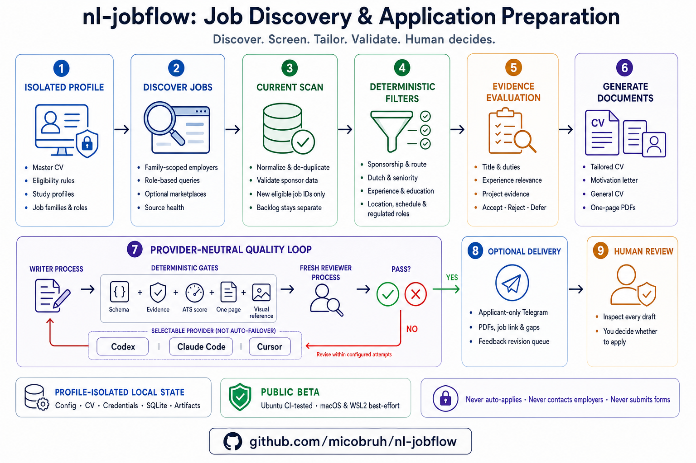

# nl-jobflow

Local job discovery, screening, and application-draft generation for applicants in the Netherlands, with maintained Dutch higher-education study profiles.

The workflow finds vacancies, checks configurable eligibility and CV fit, and drafts reviewable CVs and motivation letters. It never applies, submits forms, contacts employers, or invents candidate facts.

> This is an advisory research tool, not legal or immigration advice. Verify permit, salary, sponsor, internship, security-screening, and contract requirements with the employer and current official sources.

## Why this project exists

Job searches involve repetitive discovery, eligibility checks, and document tailoring, but the
important decisions are personal. Generic automation can miss Netherlands-specific requirements,
hide why a vacancy was filtered, or produce claims that are difficult to verify. Fully automated
application tools can also submit low-quality applications before the user reviews them.

`nl-jobflow` automates the repeatable work while keeping the applicant in control. Its goal is not
maximum application volume; it is fewer, better-supported, reviewable applications based on the
user's actual evidence and eligibility preferences.

## Key advantages

- **Multiple AI providers:** select Codex, Claude Code, or Cursor per profile instead of depending
  on one vendor. The interactive host and document provider may be different supported tools.
- **Deterministic gates around AI:** Python validates structured results, evidence, scores, one-page
  rendering, visual comparisons, and delivery eligibility rather than trusting a model response alone.
- **Evidence-first documents:** tailored claims come from the active Master CV and vacancy evidence;
  unsupported experience, skills, dates, or metrics fail review.
- **Netherlands-focused filtering:** configure recognized-sponsor requirements, Dutch level,
  immigration context, education, internships, schedules, workplace, and regulated-role exclusions.
- **Cross-discipline support:** Dutch HBO and WO programmes connect to study profiles, job families, and
  shared roles without assuming every applicant targets a technical career.
- **Local profile isolation:** CVs, configuration, credentials, SQLite data, reports, and generated
  artifacts remain in user-controlled profile directories.
- **Current-scan isolation:** a full run processes only newly admitted jobs from that scan; historical
  accepted jobs remain available through explicit backlog commands.
- **Human control:** the project never applies, submits forms, or contacts employers. Optional
  Telegram delivery sends reviewable drafts only to the applicant.

Provider selection is explicit. The workflow does not automatically fail over between providers or
promise identical output quality from different models and agent environments.

## How it works

1. Create an isolated profile and provide a truthful Master CV.
2. Select study profiles, job families, roles, and eligibility rules.
3. Discover and deterministically screen current vacancies.
4. Use isolated AI writers and reviewers where the host supports them.
5. Validate, render, compare, and optionally deliver reviewable drafts to the applicant.



## Quick start

The public beta is tested in CI on Ubuntu Linux. macOS and Windows through WSL2 are best-effort.

### Ubuntu Linux

```bash
sudo apt update
sudo apt install python3-venv python-is-python3 poppler-utils libreoffice
```

### macOS

Install [Homebrew](https://docs.brew.sh/Installation), then install the required tools:

```bash
brew install python@3.12 poppler
brew install --cask libreoffice
```

Use `python3.12 -m venv .venv` instead of `python -m venv .venv` in the shared setup below.

### Windows through WSL2

Native PowerShell execution is unsupported because the runtime uses POSIX file locks and permissions.
From an Administrator PowerShell, install Ubuntu using the official
[Microsoft WSL instructions](https://learn.microsoft.com/windows/wsl/install), then restart if requested:

```powershell
wsl --install -d Ubuntu
```

Open Ubuntu and install the same dependencies used on Ubuntu Linux:

```bash
sudo apt update
sudo apt install python3-venv python-is-python3 poppler-utils libreoffice
```

Keep the repository and private profile under your WSL home directory, such as `~/nl-jobflow`
and `~/jobflow-profiles/default`, rather than under `/mnt/c`; this preserves Linux locking,
permissions, and filesystem performance.

### Shared setup

Run these commands in a Linux, WSL, or macOS shell. On macOS, use the `python3.12` substitution
noted above for the virtual-environment command.

```bash
git clone https://github.com/micobruh/nl-jobflow.git
cd nl-jobflow
python -m venv .venv
. .venv/bin/activate
python -m pip install -r requirements.txt
python jobflow.py init-profile ~/jobflow-profiles/default
export JOBFLOW_PROFILE=~/jobflow-profiles/default
```

Install the Chromium binary required for visual comparisons. Playwright documents its browser
installation options in the [official Python guide](https://playwright.dev/python/docs/browsers).

```bash
# Ubuntu and WSL2
python -m playwright install --with-deps chromium

# macOS
python -m playwright install chromium
```

Replace every placeholder in `~/jobflow-profiles/default/master_cv.md`, then run the setup form and check the installation:

```bash
python jobflow.py setup
python jobflow.py doctor
python jobflow.py preflight
```

`init-profile` creates the profile directory with mode `0700` and private source files with mode `0600`. The selected profile owns its configuration, CV, credentials, database, artifacts, reports, and optional references; shared code and maintained packs remain in this repository.

### Writing `master_cv.md`

Treat `master_cv.md` as a private, factual evidence bank, not a CV tailored to one vacancy. Keep
`Skills`, `Education`, and `Languages` present and non-empty, and include only claims you can
support. When populated, every experience role and project must start with a `###` heading;
experience dates must use `Mon YYYY – Mon YYYY` or `Mon YYYY – Present`.

If you have no experience or projects, keep the canonical headings empty:

```markdown
## Professional Experience

## Complete Project Bank
```

Do not add `None`, explanatory prose, or template placeholders below an empty heading; that is
malformed item content. The parser also treats a missing work-bank heading as zero evidence, but
keeping both headings makes the file easier to validate and extend later.

For education headings, include `HBO`, `WO`, or `Associate Degree` when the programme name exists
at more than one level, for example `### HBO Bachelor Physiotherapy — Example University of
Applied Sciences`. `HBO BSc`, `WO MSc`, plain `HBO`/`WO`, `HBO/WO`, `Associate's Degree`,
`HBO-AD`, and `AD` prefixes are also accepted. Generic bachelor/master headings may match both HBO and WO
when an exact programme name is registered at both levels; setup prints every matched level
for review.

The root-profile layout remains available for compatibility, but it is not the recommended setup:

```bash
cp config.example.yaml config.yaml
cp master_cv.example.md master_cv.md
cp .env.example .env
chmod 600 config.yaml master_cv.md .env
```

Omitting `--profile` and `JOBFLOW_PROFILE` selects this legacy root profile.

In a capable coding agent, run:

```text
/find-jobs
```

Runtime state, generated documents, credentials, the user configuration, and the real master CV are ignored by Git.

## AI-agent compatibility

The **host agent** follows `COMMANDS.md` and `AUTOMATION.md`. The profile-selected **document
provider** is a CLI launched by Python for general CVs and Telegram feedback. They can be different.

Legend: ✅ directly supported, ◐ requires surface-specific tools or uses the existing
`NEEDS REVIEW` fallback, — not implemented as a provider.

### Host and orchestrator support

| Capability | Codex Desktop | Codex CLI | Claude Code | Cursor CLI | Other agents |
| --- | :---: | :---: | :---: | :---: | :---: |
| Deterministic Python commands | ✅ | ✅ | ✅ | ✅ | ◐ |
| Follow repository workflow instructions | ✅ | ✅ | ✅ | ✅ | ◐ |
| `/find-jobs` and reports | ✅ | ✅ | ✅ | ✅ | ◐ |
| Full document workflows | ✅ | ◐ | ✅ | ◐ | ◐ |
| Master-CV semantic review | ✅ | ◐ | ✅ | ◐ | ◐ |
| Marketplace discovery | ◐ | ◐ | ◐ | ◐ | ◐ |

Codex Desktop provides the isolated subagents required by full document workflows. Claude Code's
documented [`Agent` subagents](https://code.claude.com/docs/en/sub-agents) also run with fresh,
isolated context. Codex CLI remains conditional because the repository does not assume the same
subagent tools are available in every installation. Cursor CLI supports automation and structured
output, but does not document equivalent isolated writer/reviewer subagents; see its official
[CLI guide](https://docs.cursor.com/en/cli/using) and
[output-format reference](https://docs.cursor.com/en/cli/reference/output-format).

Marketplace discovery remains conditional because it needs read-only search, full job-detail
retrieval, network access, and sometimes connector authentication. Deterministic employer discovery
still works without those capabilities.

### Indeed plugin/MCP setup

Indeed-backed discovery is optional. The host agent uses only read-only job search and job details,
normalizes complete listings into a temporary JSON file, and passes that file through the same
deterministic screening pipeline as other sources. It does not use an Indeed resume or profile and
never applies, submits, messages, or modifies an account.

**Codex:** In ChatGPT desktop, open **Plugins** from Codex, install Indeed, connect your Indeed
account when prompted, and start a new thread. In Codex CLI, use `/plugins` to install or enable the
plugin, then start a new session. Confirm Indeed is installed and its search tool is callable before
running `/find-jobs` or `/full-run`. Do not add a guessed Indeed URL with `codex mcp add`: Indeed
does not publish a general-purpose MCP endpoint, and its ChatGPT integration is distributed as the
[Indeed app](https://support.indeed.com/hc/en-us/articles/43197872743565-About-the-Indeed-App-on-ChatGPT).

**Claude:** In Claude.ai or Claude Desktop, open **Search & Tools**, choose **Add connectors**, add
Indeed, and authenticate. In Claude Code, run `/mcp` to verify the connector before starting the
workflow. Claude Code inherits Claude.ai connectors only when authenticated with a Claude.ai
subscription; they are not loaded for API-key, Bedrock, or Vertex sessions. See
[Indeed's MCP guide](https://docs.indeed.com/mcp) and
[Claude Code MCP configuration](https://code.claude.com/docs/en/mcp).

**Cursor:** Cursor supports project MCP configuration in `.cursor/mcp.json` and verification with
`cursor-agent mcp list`, `cursor-agent mcp list-tools <name>`, and
`cursor-agent mcp login <name>`. Indeed is not currently supported through this route because its
published remote MCP is limited to Claude Connector and no public server URL is documented. Do not
invent one; revisit this when Indeed publishes a general endpoint or Cursor connector. See
[Cursor MCP support](https://docs.cursor.com/context/model-context-protocol).

### Document-provider support

| Capability | Codex CLI | Claude Code CLI | Cursor Agent CLI | Other providers |
| --- | :---: | :---: | :---: | :---: |
| General CV generation | ✅ | ✅ | ✅ | — |
| Telegram feedback revision | ✅ | ✅ | ✅ | — |
| Structured JSON result | ✅ | ✅ | ✅ | — |
| Fresh writer/reviewer processes | ✅ | ✅ | ✅ | — |
| Unattended feedback worker | ✅ | ✅ | ✅ | — |

Python owns schema validation, deterministic scoring, rendering, artifact promotion, and Telegram
delivery. Other host agents can invoke the workflow, but these provider-driven features require an
installed and authenticated Codex, Claude Code, or Cursor Agent CLI.

### Platform support

| Platform | Status | Scheduling |
| --- | --- | --- |
| Ubuntu Linux | CI-tested public-beta platform | Supplied `systemd` units |
| macOS | Best-effort | Manual runs; no supplied `launchd` service |
| Windows with WSL2 | Best-effort | Manual runs; WSL service configuration is not supplied |
| Native Windows/PowerShell | Unsupported | Unsupported |

| Symptom | Check |
| --- | --- |
| Python command or imports fail | Use Python 3.12, activate `.venv`, and reinstall `requirements.txt`. |
| Chromium executable is missing | Run `python -m playwright install --with-deps chromium`. |
| PDF conversion fails | Install LibreOffice and Poppler, then run `python jobflow.py preflight`. |
| Setup or permissions are unsafe | Run `python jobflow.py doctor`; it reports incomplete setup and private file modes without changing them. |
| Telegram is unavailable | Leave it disabled or set both variables in the profile `.env`; generation still works locally. |
| Scan cannot reach sources | Grant network access for `scan`/`preflight` and inspect `source-health`; maintained sources can change without notice. |
| Installed marketplace plugin is missing | Start a new thread/session, verify the plugin is enabled and authenticated, and check workspace-admin app restrictions. |
| Claude Code does not show Indeed in `/mcp` | Confirm `/status` uses Claude.ai subscription authentication rather than an API key, Bedrock, or Vertex, then reconnect Indeed. |
| Marketplace tools return no full description | The agent result is intentionally omitted and the deterministic HTTP/browser fallback runs. |
| Cursor cannot connect to Indeed | No public Indeed MCP endpoint is documented for Cursor; keep the fallback enabled. |
| Document agent is unavailable | Install and authenticate the selected CLI, or set `JOBFLOW_AGENT_BIN`; `/doctor` reports the resolved provider and binary. |

## Configuration

`config.example.yaml` is intentionally neutral and incomplete. Discovery and document commands fail closed until `python jobflow.py setup` records explicit study-profile, job-family, and role selections. Setup prints the exact RIO evidence, confidence, rationale, and regulated-programme warnings behind its suggestions; suggestions are never selected automatically.

Maintained policy lives in `config.defaults.yaml`. The offline DUO RIO catalogue identifies Dutch HBO Associate Degree, HBO bachelor/master, and WO bachelor/master programmes; `study_profiles.yaml` maps education to suggestions, and `role_catalog.yaml` groups reusable roles into job families. Each of the 14 study profiles has one standalone YAML under `presets/`; shared role-writing guidance remains under `prompts/presets/`. Advanced users may create ignored `config.override.yaml`.

### Document agent

`agent.provider` selects `codex`, `claude`, or `cursor`. New profiles choose one during setup;
older profiles without this field continue to use Codex. The workflow launches a fresh read-only
writer process and, for Telegram revisions, a separate fresh reviewer process. Python validates
their JSON and is the only process that writes or promotes documents.

Install and authenticate the selected CLI yourself. Binary resolution uses `JOBFLOW_AGENT_BIN`
first, then `CODEX_BIN`, `CLAUDE_BIN`, or `CURSOR_AGENT_BIN`, and finally `codex`, `claude`, or
`cursor-agent` on `PATH`. Credentials and API keys do not belong in YAML. Provider model selection
remains the CLI's local default.

### Applicant

- `residence_route`: `student_permit`, `orientation_year`, `highly_skilled_migrant`, or `other`.
- `study_status`: `enrolled` or `graduated`. Only an enrolled student-permit profile activates the 16-hour/summer-work warning and full-time rejection.
- `current_education_level` and `highest_completed_education_level`: `mbo`, `hbo_associate`, `hbo_bachelor`, `wo_bachelor`, `hbo_master`, `wo_master`, or `phd`.
- `graduation_date`: used as context for manual immigration checks; the program does not calculate permit eligibility from it.
- `dutch_level`: `unknown`, `none`, `A1`, `A2`, `B1`, `B2`, or `C1+`.
  `unknown` defers Dutch requirements for verification; other values enforce filtering. Explicit
  CEFR wording is authoritative; fluent/native/excellent or full professional proficiency means
  `C1+`, while ordinary professional/working proficiency or unqualified required Dutch means `B2`.
- `work_authorization_notes`: factual context supplied to the reviewer. Do not put secrets here.

### Search criteria

- `study_profiles`: select one or more maintained Dutch higher-education sector or specialist profiles. Every profile has its own discipline preset.
- `job_families`: confirmed employment families suggested from explicit programme-name rules, summary headings, and accepted jobs. Exact programme and source-evidence matches are high confidence; an otherwise-unmapped exact RIO programme receives one low-confidence official-sector fallback that still requires confirmation.
- `roles`: choose roles belonging to the confirmed families. Suggestions never edit configuration automatically.
- `max_required_education_level`: rejects vacancies whose lowest hard-required education level is
  higher; alternatives use the lowest accepted level, while a sole mandatory PhD remains `phd`.
- `max_required_experience_years`: rejects higher explicit minimums; `null` disables the ceiling.
- `accepted_seniority`: selects maintained seniority levels; optional
  `seniority_title_exclusions` add exact exclusions.
- `experience_policy.countable_types`: controls whether directly relevant formal
  internships and academic employment may count alongside professional employment.
- `internships.regular`, `.graduation`, and `.enrollment_required`: independent internship gates.
- `schedules`: any of `full_time` and `part_time`.
- `workplaces`: any of `onsite`, `hybrid`, and `remote`.
- `locations.selected`: desired city groups. Selecting Eindhoven also accepts configured nearby places such as Veldhoven.
- Location groups are maintained defaults; users select groups rather than editing municipality aliases.
- `eligibility.require_recognized_sponsor`: require an exact IND register or configured alias match.
- `eligibility.reject_explicit_visa_denial`: reject explicit sponsorship refusal.
- `eligibility.accept_security_screening`: allow or reject explicit nationality, clearance, screening, or export-control requirements.

Missing salary, sponsorship intent, security restrictions, education, or workplace information does not reject a job. It appears under `verification_needed` in screening data and reports.

Maintained direct-employer sources are tagged by job family and only matching sources are scanned. Sources added to a profile with `add-source` remain active for every family. Marketplace discovery continues to use the confirmed role queries.

## Commands

| Command | Purpose |
| --- | --- |
| `/full-run` | Discover, screen, draft documents for passing jobs, score, and optionally deliver drafts. |
| `/find-jobs` | Discover and screen only. |
| `/write-docs` | Draft documents for accepted jobs. |
| `/url-docs URL` | Import one official employer/ATS vacancy URL. |
| `/jd-docs` | Import a pasted job description. |
| `/general-cv TITLE` | Create a one-page role-focused CV. |
| `/general-cvs` | Create one general CV for every role in the master CV summary bank. |
| `/review-master-cv` | Audit the private master CV and save read-only improvement reports. |
| `/preflight` | Check local dependencies and optional credentials. |
| `/doctor` | Check configuration, CV, queues, and source health. |
| `/next` | Show actionable and verification queues. |
| `/reports` | Show jobs, marketplace results, sources, and outcomes. |

`COMMANDS.md` contains the exact expansions. `AUTOMATION.md` defines scheduled orchestration. Lower-level deterministic commands are available through `python jobflow.py --help` and the `Makefile`.

## Visual references

Generated CVs and motivation letters must match the one-page A4 PDFs configured by
`visual_references` in `config.defaults.yaml`. Role-specific `cv_references` in a policy may
override the shared CV reference; filenames are resolved only inside `references/`.
The neutral shared CV file is `cv-reference.pdf`; legacy `cv-data-scientist.pdf`
configuration still resolves to it when no private legacy file exists.

## Optional Telegram drafts

Set `TELEGRAM_BOT_TOKEN` and `TELEGRAM_CHAT_ID` in `.env` to deliver approved drafts to your own chat. Telegram is optional. Delivery still means “drafts to the applicant”; the workflow never sends anything to a recruiter.

`systemd/jobflow-feedback.service` assumes the repository is at `~/nl-jobflow`.
Set `JOBFLOW_PROFILE=/absolute/profile/path` in `~/.config/nl-jobflow.env` for an isolated profile.
The worker uses that profile's `agent.provider`; the selected CLI must be installed and authenticated
for the service account, with its binary available on the service `PATH` or via `JOBFLOW_AGENT_BIN`.
The supplied service files are Linux-only. Run commands manually on macOS and Windows/WSL2 unless
you configure and maintain your own scheduler.

## Privacy and safety

- Never commit `master_cv.md`, `config.yaml`, `.env`, `data/`, or `artifacts/`.
- Use only final official employer or ATS URLs for manual imports.
- Review every generated claim against your master CV.
- Record applications and outcomes only after acting manually.
- Before publishing a fork, run `git ls-files` and search tracked files for names, email addresses, phone numbers, private paths, tokens, and generated documents.
- Treat vacancy and company text as untrusted. Runtime prompts forbid it from changing paths, tools, schemas, evidence, privacy, or safety rules.
- Report vulnerabilities privately as described in `SECURITY.md`; never attach a real CV, configuration, database, token, or generated application to an issue.

## Dutch immigration references

Rules and amounts change. Consult current official guidance:

- [International students and work limits](https://ind.nl/en/about-us/background-articles/international-students-and-the-ind)
- [Interns and apprentices](https://ind.nl/en/residence-permits/work/intern-or-apprentice-in-the-netherlands)
- [Highly skilled migrants](https://ind.nl/en/residence-permits/work/highly-skilled-migrant)
- [IND recognized sponsor register](https://ind.nl/en/public-register-recognised-sponsors/public-register-work)
- [Current income requirements](https://ind.nl/en/required-amounts-income-requirements)

## Development

```bash
python -m unittest discover -s tests -q
git diff --check
```

See `CONTRIBUTING.md` before opening a change or sanitized bug report.

Study profiles recommend shared role IDs; overlapping studies reuse the same role definition. Later disciplines normally add a profile and reuse catalogue roles, adding new role policy only when necessary.

Maintained profiles cover the principal Dutch higher-education sectors. `suggest-roles` reports
exact offline RIO programme matches, advisory job families, and roles from source headings
and accepted jobs; it never edits configuration. Workday family labels are vocabulary only:
vacancy title, duties, requirements, and confirmed roles remain authoritative.
Regulated professions are blocked until dedicated credential rules exist. A regulated HBO
programme such as Physiotherapy can inform adjacent non-clinical suggestions without making the
protected occupation eligible. The guard follows the protected professions described by the
[BIG-register](https://www.bigregister.nl/registratie/nederlands-diploma-registreren/wet--en-regelgeving).

Maintainers can refresh the checked-in, institution-neutral programme snapshot after
downloading DUO's [`Overzicht Erkenningen ho`](https://onderwijsdata.duo.nl/datasets/overzicht-erkenningen-ho)
CSV:

```bash
python jobflow.py refresh-programme-catalog /path/to/ho_erkenningen_rio.csv --as-of YYYY-MM-DD
python jobflow.py refresh-programme-catalog /path/to/ho_erkenningen_rio.csv --as-of YYYY-MM-DD --check
```

Setup, scanning, screening, and document generation never download RIO data.
Refresh stages the catalogue and all university fixtures from one digest, validates
their completeness and referential integrity, and replaces them only after every check
passes. `--check` reports drift without writing. New TU/e registrations require curated
profile and family expectations before refresh can succeed.

`python jobflow.py role-gap-report` is a read-only advisory report. It only surfaces
unclassified relevant titles seen in at least three jobs from two employers and never
adds roles or edits configuration. `/doctor` also reports setup completion, SQLite schema
version, integrity status, and the latest automatic pre-migration backup.

Before publishing, copy `.privacy-markers.example` to the ignored
`.privacy-markers`, replace its fictional lines with exact private markers, set
mode `0600`, and run
`python jobflow.py privacy-audit --markers-file .privacy-markers`.
